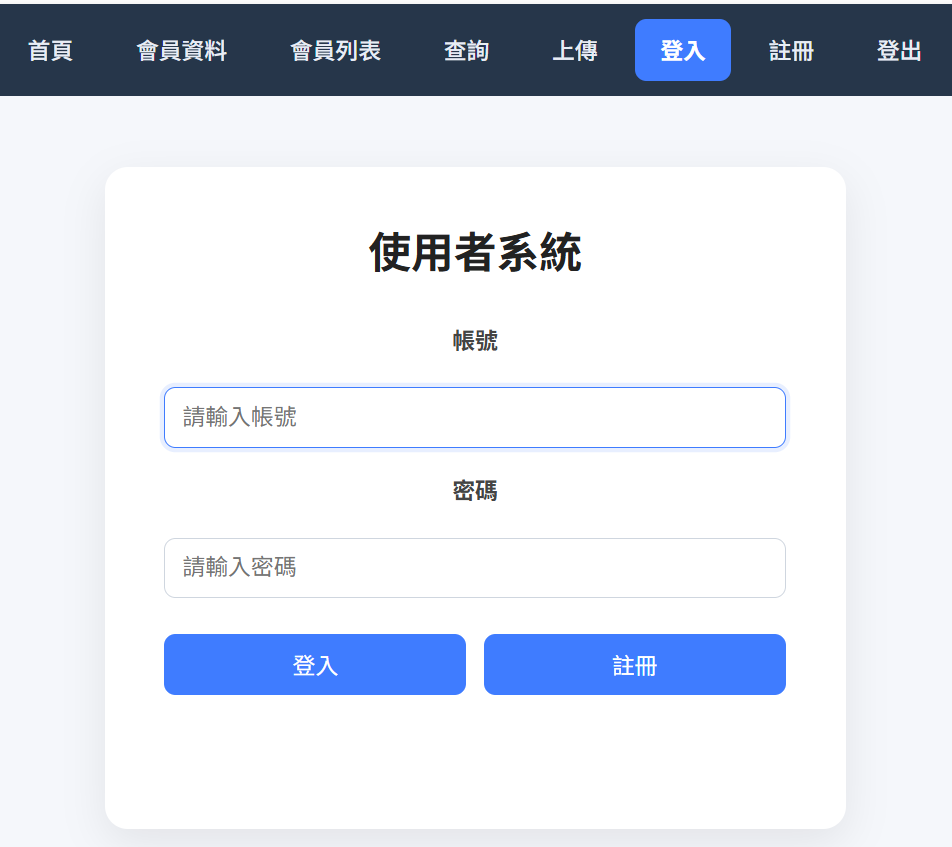
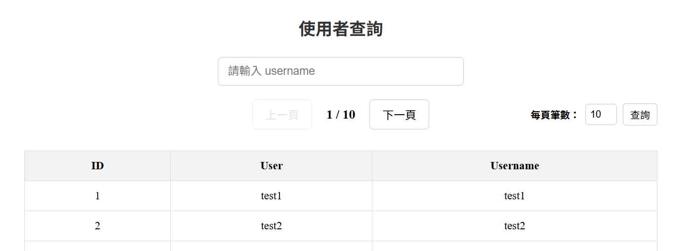
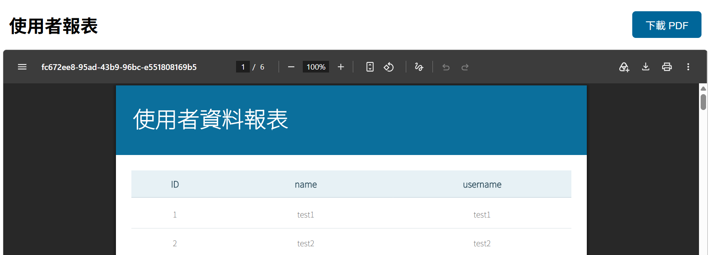
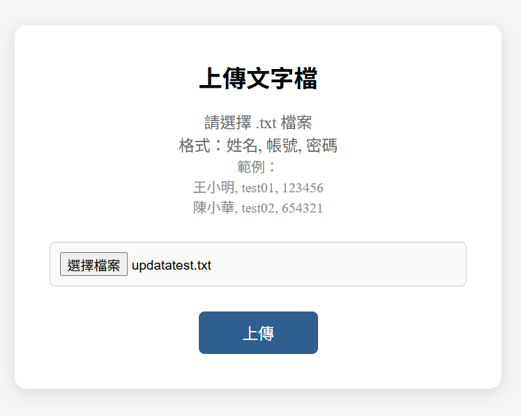

# UserWeb

一個以前後端分離架構開發的使用者管理系統，使用 **Spring Boot + React + MySQL** 建置。

專案包含會員註冊、登入驗證、JWT 身分驗證、使用者資料查詢、
分頁、個人資料管理、檔案上傳、PDF 報表產生等功能，
並使用 Docker 建立 MySQL 與後端執行環境，
以及透過 JMeter 進行 API 效能測試。

🎥 **專案測試影片：**  
[YouTube - UserWeb 專案測試影片](https://www.youtube.com/watch?v=PxwYS4y01Fg)

---

## 🖥️ 專案畫面

### 🔐 使用者登入

使用者可透過帳號與密碼登入系統，登入成功後取得 JWT Access Token 與 Refresh Token，後續 API Request 會透過 Token 進行身分驗證。



---

### 🔎 使用者查詢與分頁

支援 Username 關鍵字查詢與分頁功能，可切換上一頁、下一頁，並自行設定每頁顯示的資料筆數。



---

### 📄 PDF 使用者報表

透過 JasperReports 將資料庫中的使用者資料產生 PDF 報表，可直接於瀏覽器預覽或下載 PDF。



---

### 📂 文字檔批次匯入

支援上傳 `.txt` 文字檔批次新增使用者資料。

匯入過程使用 Transaction 控制，若其中一筆資料發生錯誤，整批資料會進行 Rollback，避免部分資料寫入造成資料不一致。



---

## 📌 專案功能

### 使用者功能

- 使用者註冊
- 使用者登入 / 登出
- JWT 身分驗證
- Access Token / Refresh Token
- Token 過期處理
- 使用者個人資料管理
- 使用者資料查詢
- 關鍵字搜尋
- 分頁查詢
- 每頁顯示筆數設定

### 資料處理

- JPA Repository
- MyBatis
- MySQL 資料庫
- Transaction 交易控制
- 檔案資料匯入
- 匯入失敗 Rollback

### 報表

使用 **JasperReports** 產生使用者 PDF 報表。

支援：

- PDF 預覽
- PDF 下載
- 中文字型顯示
- 從資料庫取得資料產生報表

### Security

使用 **Spring Security** 建立 API 身分驗證機制。

主要包含：

- Spring Security
- JWT
- RSA 非對稱式數位簽章
- Access Token
- Refresh Token
- Stateless Authentication
- API 權限驗證

登入成功後，後端會產生 JWT：

```text
Login
  │
  ▼
AuthenticationManager
  │
  ▼
UserDetailsService
  │
  ▼
驗證帳號 / 密碼
  │
  ▼
產生 Access Token + Refresh Token
  │
  ▼
React 儲存 Token
  │
  ▼
Authorization: Bearer <token>
  │
  ▼
JwtFilter
  │
  ▼
RSA Public Key 驗證 JWT
  │
  ▼
SecurityContext
  │
  ▼
Controller
```

---

## 🛠️ 使用技術

### Backend

- Java
- Spring Boot
- Spring MVC
- Spring Security
- Spring Data JPA
- MyBatis
- JWT
- RSA
- Maven
- JasperReports

### Frontend

- React
- Vite
- React Router
- JavaScript
- HTML
- CSS
- Fetch API

### Database

- MySQL

### Testing / Tools

- Postman
- JMeter
- Docker
- Docker Compose
- Git
- Sourcetree

---

## 🏗️ 系統架構

```text
┌─────────────────┐
│      React      │
│   localhost     │
│      :5173      │
└────────┬────────┘
         │
         │ REST API / JSON
         │ JWT
         ▼
┌─────────────────┐
│   Spring Boot   │
│   localhost     │
│      :8080      │
└────────┬────────┘
         │
         ├───────────────┐
         │               │
         ▼               ▼
┌─────────────────┐  ┌─────────────────┐
│      JPA        │  │     MyBatis     │
└────────┬────────┘  └────────┬────────┘
         │                    │
         └─────────┬──────────┘
                   ▼
          ┌─────────────────┐
          │      MySQL      │
          │      :3306      │
          └─────────────────┘
```

---

## 🔐 JWT 驗證流程

系統採用 **Stateless JWT Authentication**。

前端登入：

```http
POST /api/user/login
```

登入成功後取得：

```json
{
  "accessToken": "...",
  "refreshToken": "...",
  "user": {
    "id": 1,
    "user": "User",
    "username": "user01"
  }
}
```

之後存取需要登入的 API 時，在 Request Header 加入：

```http
Authorization: Bearer <accessToken>
```

後端透過 `JwtFilter` 進行驗證：

1. 取得 Authorization Header
2. 解析 Bearer Token
3. 使用 RSA Public Key 驗證 JWT
4. 取得 Username 與 Authorities
5. 建立 Authentication
6. 寫入 SecurityContext
7. 通過 Spring Security 驗證後進入 Controller

---

## 🔑 Access Token / Refresh Token

系統將 JWT 分成 Access Token 與 Refresh Token：

```text
Access Token
    │
    ├── 用於存取一般 API
    │
    └── 有效時間較短

Refresh Token
    │
    └── Access Token 過期時取得新的 Access Token
```

Access Token 過期時，後端會回傳：

```json
{
  "message": "JWT_EXPIRED"
}
```

前端可依照回傳結果處理登入過期狀態。

---

## 📡 API

主要 API：

| Method | API | 功能 |
|---|---|---|
| POST | `/api/user/login` | 登入 |
| POST | `/api/user/register` | 註冊 |
| POST | `/api/user/logout` | 登出 |
| POST | `/api/user/refresh` | 更新 Access Token |
| GET | `/api/user/me` | 取得目前登入使用者 |
| GET | `/api/user` | 取得使用者資料 |
| GET | `/api/user/search` | 搜尋 / 分頁 |
| GET | `/api/user/usercontext` | 取得個人資料 |
| POST | `/api/user/usercontext` | 儲存個人資料 |
| GET | `/api/user/users` | 產生 PDF 報表 |

---

## 🔎 搜尋與分頁

支援 Username 關鍵字搜尋與分頁功能：

```http
GET /api/user/search?username=user&page=0&size=10
```

參數：

| Parameter | 說明 |
|---|---|
| `username` | 搜尋關鍵字 |
| `page` | 頁碼 |
| `size` | 每頁資料筆數 |

前端依照資料總筆數計算頁數：

```javascript
Math.ceil(total / size)
```

---

## 📄 JasperReports

使用 **JasperReports** 產生 PDF 報表。

流程：

```text
MySQL
  │
  ▼
Repository / DAO
  │
  ▼
List<User>
  │
  ▼
JRBeanCollectionDataSource
  │
  ▼
JasperReports
  │
  ▼
PDF
  │
  ├── Browser Preview
  │
  └── Download
```

---

## 📂 檔案匯入

系統支援文字檔資料匯入。

匯入流程：

```text
Upload File
     │
     ▼
Spring Boot
     │
     ▼
解析資料
     │
     ▼
@Transactional
     │
     ▼
Database
```

若其中一筆資料發生錯誤，會透過 **Transaction Rollback** 避免部分資料成功寫入而造成資料不一致。

---

## 🐳 Docker

專案使用 Docker 建立執行環境。

主要 Container：

```text
userweb-app
     │
     ▼
userweb-network
     │
     ▼
mysql-db
```

Docker Compose 啟動：

```bash
docker compose up -d
```

停止：

```bash
docker compose down
```

查看後端 Log：

```bash
docker compose logs -f userweb
```

---

## ⚡ JMeter Performance Testing

使用 **Apache JMeter** 對 API 進行效能測試。

測試流程包含：

```text
Login
  ↓
Search
  ↓
User Data
  ↓
Report
  ↓
File Upload
  ↓
Logout
```

測試不同 Concurrent Users：

- 10 Threads
- 20 Threads
- 50 Threads

主要觀察：

- Response Time
- Throughput
- Error Rate
- HTTP Status
- JWT Authentication
- API 在多人同時請求下的行為

---

## 🗄️ Database

主要資料表：

### `user`

| Column | 說明 |
|---|---|
| `id` | Primary Key |
| `user` | 使用者姓名 |
| `username` | 登入帳號，Unique |
| `password` | 使用者密碼 |

其中密碼不直接儲存明文，而是儲存加密後的密碼。

### `usercontext`

| Column | 說明 |
|---|---|
| `id` | Primary Key |
| `userid` | 對應使用者 ID |
| `age` | 年齡 |
| `email` | Email |
| `address` | 地址 |

`userid` 與 `user.id` 建立關聯。

---

## ▶️ 執行專案

### Backend

進入 Spring Boot 專案後執行：

```bash
mvn spring-boot:run
```

Backend：

```text
http://localhost:8080
```

### Frontend

進入 React 專案後執行：

```bash
npm install
npm run dev
```

Frontend：

```text
http://localhost:5173
```

---

## 📚 專案學習重點

透過此專案實作與練習：

- RESTful API 設計
- Spring Boot Web Application
- React 前後端分離
- Spring Security
- JWT Authentication
- RSA Digital Signature
- Access Token / Refresh Token
- JPA
- MyBatis
- Transaction Management
- MySQL
- JasperReports
- File Upload
- Docker / Docker Compose
- JMeter Performance Testing
- Git Version Control

---

## 👤 Author

**呂育展**

Java Backend / Full-Stack Practice Project
